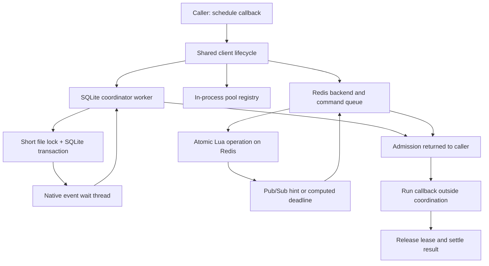

# Architecture

Semaphile separates callback lifetime from shared admission state. Application
callbacks run in the caller's JavaScript runtime. A backend decides when each
callback may start and records its lease, which represents reserved capacity.

## Follow one request

1. **Validate and queue.** The shared client checks weight, request expiration,
   cancellation and whether it is closing. It tracks both the result returned
   to the caller and a cleanup promise used by shutdown.
2. **Attempt admission.** The backend checks shared concurrency, spacing and
   budget atomically. A denied attempt spends nothing. The local queue waits
   for a capacity hint or the next computed useful deadline, then checks again.
3. **Accept a grant.** Admission returns a unique lease identity, weight, grant
   time and optional expiration. The client retains the identity before checking
   cancellation; a grant arriving after cancellation still needs release.
4. **Dispatch.** A cancelled job never runs. An already expired grant rejects
   with `LeaseExpiredError`. Otherwise the callback runs outside every lock,
   transaction and Redis script.
5. **Release and settle.** Success or failure releases concurrency. Budget and
   spacing are not refunded. Callback errors retain their original value,
   including `undefined` or `false`; simultaneous callback and cleanup failures
   are reported together.

## Shared client state

`packages/core/src/client.ts` owns callback results, cancellation, cleanup and
close/drain behavior. All three backends use it. Its `ClientBackend` boundary is
exported through `@semaphile/core/client` and imports no SQLite or native code.

A queued cancellation can settle the caller's result immediately while cleanup
is still pending. Consequently, `close()` waits on each job's cleanup promise,
not merely the promises returned by `schedule()`. After a callback starts,
cancelling its scheduling signal does not release capacity early or abort an
arbitrary SDK request.

The first close call chooses drain behavior. Default close cancels queued work;
drain close also finishes previously accepted queued work. Both await running
callbacks and cleanup, and can wait indefinitely for a hung callback.

## Execution and control state

`execution.ts` keeps one accepted operation identity across attempts. Each attempt
uses the normal admission path and returns its lease before retry delay. Public
result settlement is separate from actual cleanup, so timeout cannot release a
still-running callback early. `http.ts` and `response-lifetime.ts` bind this
lifecycle to Fetch response delivery, body completion and cancellation.

`recovery-state.ts` fences shared cooldown and breaker generations.
`maintenance-state.ts` records acceptance, completion and unconfirmed owner loss.
`control-state.ts` composes these rules; memory and SQLite use those pure models,
while Redis implements the same transitions in `control.lua`. `administration.ts`
tracks client-local command/wait cleanup. For public behavior and examples, read
[execution and maintenance](resilience.md).

## SQLite path

`packages/core/src/index.ts` opens the public limiter and shares a coordinator
for the same canonical pool path within a JavaScript runtime. Separate worker
runtimes can have separate cooperating coordinators.

`coordinator.ts` handles messages in a worker. `backend.ts` owns the local
queue, gate and transaction wrapper. `sqlite-resources.ts` establishes and
retires descriptors, observes owner lifetimes, and implements the guarded
notification/transaction sequence. `sqlite-admission.ts` performs
one atomic admission attempt under the caller-held gate. `sqlite-types.ts`
contains the internal queue and crash-fixture types. `wake.ts` starts a native
subscription and handles its completion. Rust owns the subscription, cancellation
pipe and dedicated wait thread; close cancels and joins it. The main application
event loop does not block on the coordination lock.

All database access occurs under the short pool gate. A mutation signals the
notification file before changing SQL and keeps the gate until commit/rollback.
A waking reader must take that gate before inspecting state. Events therefore
mean “check again”; they never constitute permission to run a callback.
See [blocking](blocking.md) for descriptor ownership and crash recovery.

## Redis path

`packages/redis/src/backend.ts` manages its local admission queue and translates
protocol replies into the shared client types. `wire.ts` owns two connections,
ordered commands, notification waits, response deadlines and ownership renewal.
`protocol.lua` validates and calculates an operation before one authoritative
state write. Pool identity is derived from namespace and pool name.

An owner is renewable independently of job expiration. Due renewals get priority
between queued application commands; application command order remains intact.
At renewal, a PING on the subscription connection checks that notification
traffic still arrives. Connection failure or timeout permanently fails that
client; uncertain commands are never automatically replayed.

Redis supplies wall-clock grant/expiration timestamps. Before dispatch, the
client uses a conservative bound derived from request send time on its own
monotonic clock. It never compares another machine's wall-clock timestamp with
local `Date.now()`. Internal `ownerValidUntilMonotonic` names that distinction.

## Boundaries to preserve

A lease can expire while its callback or remote HTTP request continues. Likewise,
a partitioned Redis owner's requests may overlap work admitted after owner
recovery. A limiter cannot undo an already sent request. Queues provide local
FIFO ordering, not global fairness. SQLite requires a local filesystem; Redis
currently targets one authoritative endpoint, without Cluster/Sentinel or
failover guarantees. See the package READMEs for the remaining limitations.

## Messaging path

The messaging package has its own SQLite format and gate. A coordinator worker
owns its connection and registration lifetime descriptors. Receives arm a
per-inbox kernel subscription before checking state; a dedicated Rust thread
blocks until notification, cancellation or a computed deadline. Sends, claim
transitions and expiry reclamation notify affected inboxes before committing.

Start with `client.ts` for the public API and `coordinator.ts` for worker command
ordering. `database.ts` owns the gate and transaction boundaries; `send.ts`,
`delivery.ts`, `presence.ts` and `storage.ts` implement admission, claims,
registration and retention. `listener.ts` owns handler execution and renewal.
CLI parsing lives in `cli-options.ts`, ordinary data commands in
`cli-actions.ts`, and child/listener lifetimes in `cli-lifecycle.ts`.
`settings.ts` resolves and validates project defaults; `admin.ts` implements
initialization and observational inspection.

Messages have stable delivery IDs and fresh claim receipts for each attempt.
Process exit changes presence but does not revoke claims. Listener handlers run
in the caller's runtime, with bounded renewal and an independent expiry watchdog.
A handler's successful completion acknowledges durable acceptance by default;
manual mode leaves acknowledgment to the adapter. The receiver validates any
sender-requested acknowledgment policy before dispatch.

Cleanup processes bounded batches. Admission repeats only after actual cleanup
progress, releasing the gate between batches. Logical accounting includes
reserved space for future claim/error state, so terminal transitions can proceed
at capacity. See the [messaging reference](../packages/messaging/README.md) for
configuration, retention, retries, CLI behavior and limitations.
